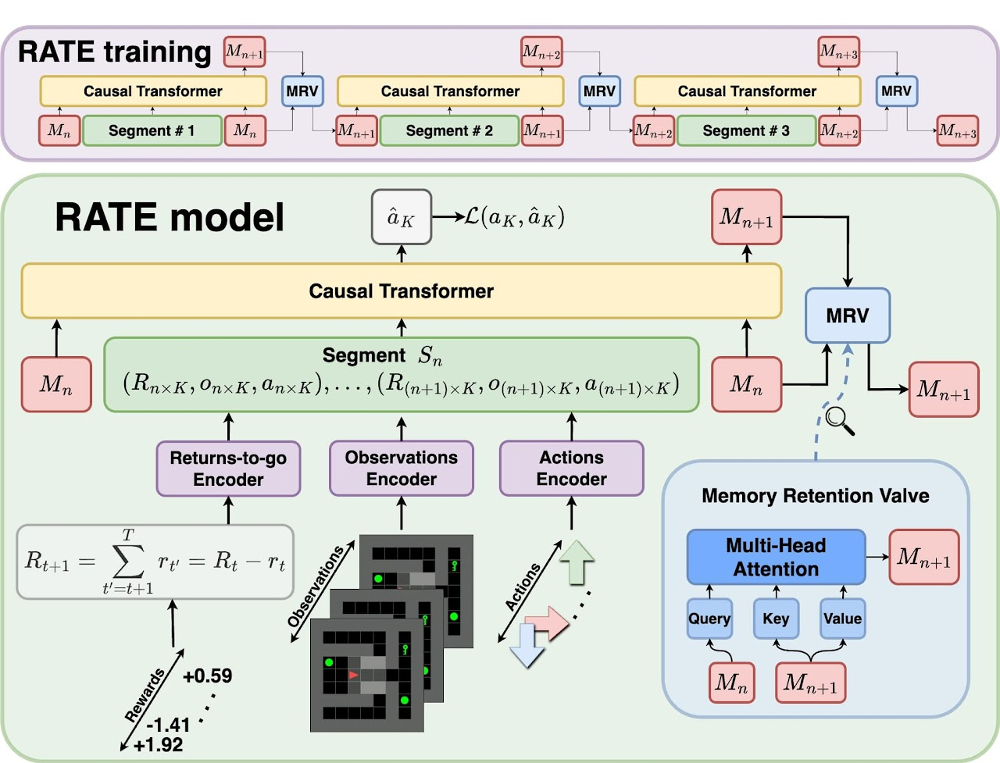

# My Implementation of RATE



This repository contains a PyTorch implementation of the Recurrent Action Transformer with Memory (RATE) model, as described in the paper ["Recurrent Action Transformer with Memory"](https://sites.google.com/view/rate-model/).

## Components

The implementation consists of the following modules:

1. **mrv.py:** Defines the MemoryRetentionValve module, which handles the multi-head attention-based memory update.
2. **ct.py:** Defines the CausalTransformer module, which is the transformer-based encoder component.
3. **rm.py:** Defines the overall RATEModel class, which combines the MemoryRetentionValve and CausalTransformer modules.
4. **train.py:** Contains the training loop for the RATE model, including loss calculation and visualization of the results.

## Usage

To train the RATE model, run the train.py script. This will train the model on the provided dummy data and plot the training loss and memory evolution over epochs.

## Might Change or Add

- Change: Probably seperate the Observations, Actions, and Returns-To-Go encoders as seperate modules.
- Add: A CartPole demo using the RATEModel (too lazy rn)

## Citation

```bibtex
@misc{cherepanov2024rate,
      title={Recurrent Action Transformer with Memory}, 
      author={Egor Cherepanov and Alexey Staroverov and Dmitry Yudin and Alexey K. Kovalev and Aleksandr I. Panov},
      year={2024},
      eprint={2306.09459},
      archivePrefix={arXiv},
      primaryClass={cs.LG},
      url={https://arxiv.org/abs/2306.09459}, 
}
```
